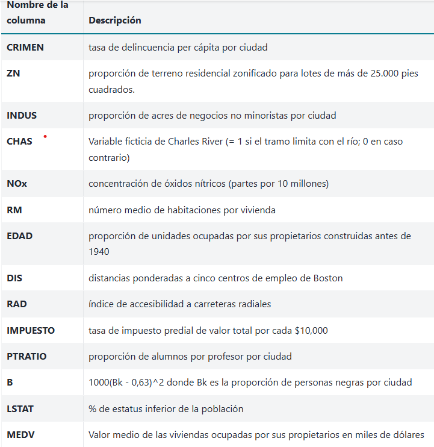
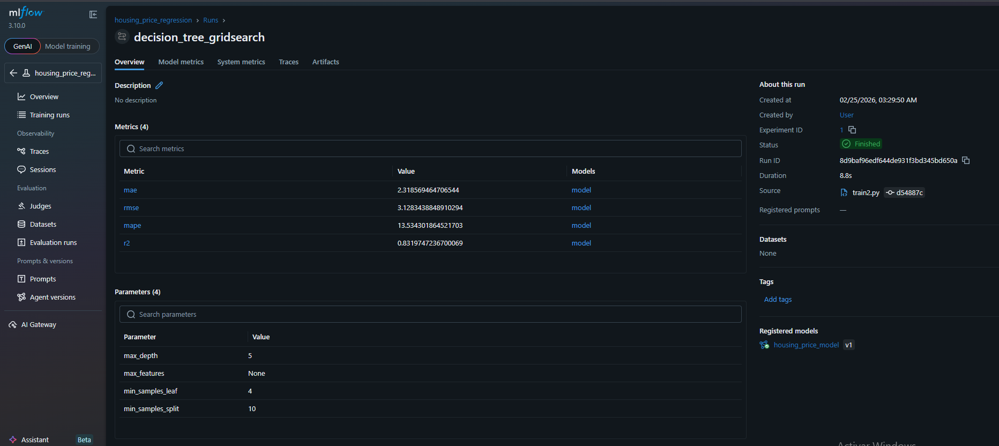
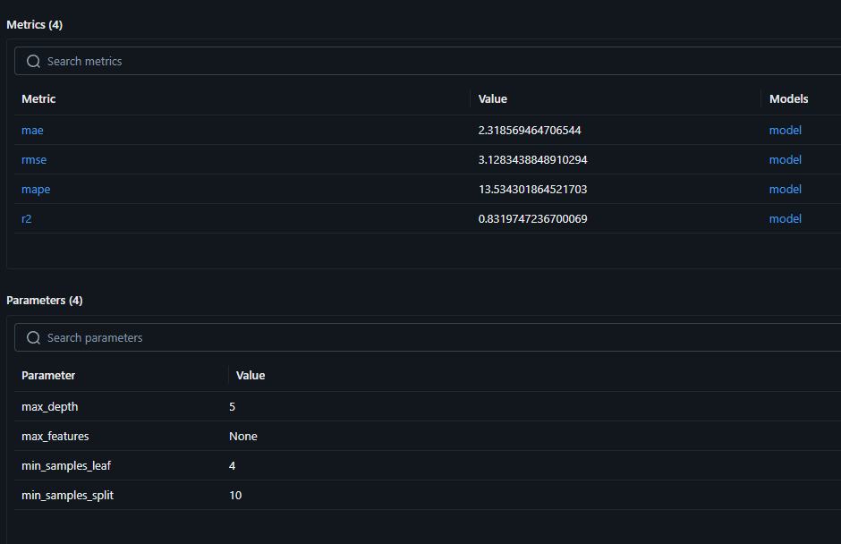
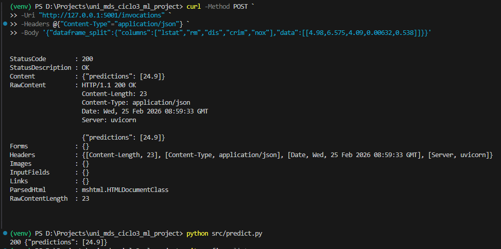

# MLOps Introduction: Final Project
FInal work description in  the [final_project_description.md](final_project_description.md) file.

Student info:
- Full name: Luis Fernando Benito Chavez
- e-mail: lbenitoc@uni.pe
- Grupo: Individual

# Project Name: Housing Price Prediction – MLOps Final Project

# A) Problem Definition

## Context

La estimación del precio de viviendas es un problema central en el mercado inmobiliario. Una predicción precisa permite:

* 🏦 Entidades financieras evaluar riesgos crediticios
* 🏘 Inmobiliarias definir estrategias de pricing
* 👨‍👩‍👧‍👦 Compradores tomar decisiones informadas
* 📊 Analistas evaluar dinámicas del mercado

En este proyecto se desarrolla un modelo de Machine Learning capaz de predecir el precio medio de viviendas (`medv`) en función de variables estructurales y socioeconómicas.

El problema se formula como:

> **Problema de regresión supervisada**
> Predecir el valor medio de viviendas ocupadas por sus propietarios (en miles de dólares).

---

## 🎯 Variable objetivo

* `medv` → Precio medio de la vivienda

## 🔎 Variables predictoras seleccionadas

Tras análisis exploratorio y selección de importancia:

* `lstat`
* `rm`
* `dis`
* `crim`
* `nox`

---

# 📊 Enfoque del Proyecto

El proyecto fue desarrollado siguiendo principios MLOps:

```
data/
src/
models/
notebooks/
```

---

## 🔹 1. Data Preparation

Archivo: `src/data_preparation.py`

Se implementó:

* Eliminación del campo `ID`
* Truncamiento de outliers mediante IQR
* Selección de 5 variables más importantes
* Generación del dataset procesado en:

```
data/training/boston_training.csv
```

---

## 🔹 2. Model Training

Archivo: `src/train.py`

Se implementó:

* `DecisionTreeRegressor`
* Optimización con `GridSearchCV`
* Evaluación con:

  * MAE
  * RMSE
  * MAPE
  * R²
* Registro del experimento en MLflow
* Registro del modelo en MLflow Model Registry

---

# 📈 Registro en MLflow

Modelo registrado:

```
housing_price_model (v1)
```

## 🔎 Vista del experimento



## 📊 Métricas del modelo



---

# 🚀 Manual de Uso del Modelo

---

# 1️⃣ Ejecutar MLflow UI

Desde la raíz del proyecto:

```bash
mlflow ui
```

Abrir en el navegador:

```
http://127.0.0.1:5000
```

Ahí se pueden visualizar:

* Experimentos
* Métricas
* Parámetros
* Artefactos
* Versiones del modelo

---

# 2️⃣ Servir el Modelo

Archivo: `src/serving.py`

Este archivo ejecuta internamente:

```bash
mlflow models serve
```

Para levantar el servidor:

```bash
python src/serving.py
```

Servidor disponible en:

```
http://127.0.0.1:5001
```

---

# 3️⃣ Realizar Predicciones (usando predict.py)

No es necesario ejecutar curl manualmente.

El archivo `src/predict.py` permite enviar solicitudes automáticamente al modelo servido.

Ejecutar:

```bash
python src/predict.py
```

Internamente, este script:

* Construye el JSON requerido por MLflow
* Envía solicitud POST a `/invocations`
* Devuelve la predicción en consola

Ejemplo de salida esperada:

```json
{
  "predictions": [24.9]
}
```

---

## 📡 Flujo completo para usar el modelo

1️⃣ Preparar datos

```bash
python src/data_preparation.py
```

2️⃣ Entrenar modelo y registrar en MLflow

```bash
python src/train.py
```

3️⃣ Visualizar experimento

```bash
mlflow ui
```

4️⃣ Servir modelo

```bash
python src/serving.py
```

5️⃣ Generar predicción

```bash
python src/predict.py
```

---

# 🏗 Arquitectura del Proyecto

```
data/
    raw/
    training/

src/
    data_preparation.py
    train.py
    serving.py
    predict.py

models/
notebooks/
```

---

# 🧠 Modelo Final

* Algoritmo: Decision Tree Regressor
* Optimización: GridSearchCV
* Registro: MLflow
* Versionado: MLflow Model Registry
* Serving: MLflow Model Serving
* Tipo: Regresión supervisada

---

# 📌 Conclusión

En este proyecto se implementó un pipeline completo bajo enfoque MLOps:

✔ Separación clara entre preparación, entrenamiento y serving
✔ Registro reproducible de experimentos
✔ Versionado formal del modelo
✔ Servicio REST listo para producción
✔ Script dedicado para generación de predicciones

El modelo puede integrarse fácilmente en:

* Aplicaciones web
* Sistemas financieros
* Plataformas inmobiliarias
* APIs externas
