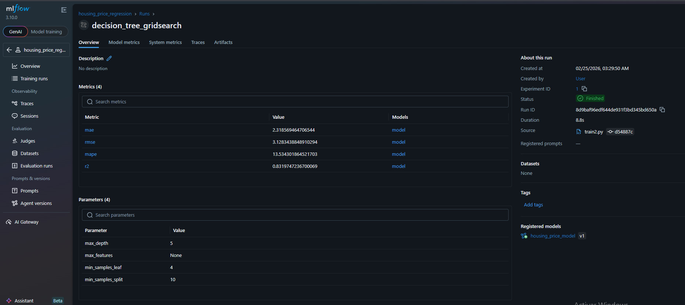

# 🏠 Housing Price Prediction -- MLOps Final Project

**Course:** Introduction to MLOps\
**Program:** UNI -- MDS Ciclo 3\
**Author:** Luis Benito Chavez\
**Year:** 2026

------------------------------------------------------------------------

# 📌 1. Problem Definition

## 🎯 Use Case

The objective of this project is to develop a Machine Learning model
capable of predicting housing prices based on structural and
socio-economic characteristics.

Potential applications include: - Real estate agencies - Mortgage
evaluation in banks - Investment analysis - Property valuation platforms

The project follows the complete Machine Learning Lifecycle and
integrates MLOps practices such as experiment tracking, model registry,
and model serving.

------------------------------------------------------------------------

# 📊 2. Dataset

We used the Boston Housing dataset.

## Selected Features

After exploratory data analysis and correlation review in the
experimentation notebook, the following five variables were selected:

-   **lstat**: Percentage of lower status population\
-   **rm**: Average number of rooms per dwelling\
-   **dis**: Distance to employment centers\
-   **crim**: Crime rate\
-   **nox**: Nitric oxides concentration

### Why only these 5 variables?

-   They showed strong correlation with the target variable (price).
-   They reduced multicollinearity issues.
-   They provided a balance between model simplicity and predictive
    performance.
-   Feature selection experiments showed no significant improvement when
    including all original variables.

Target variable: - **price** (median house value)

------------------------------------------------------------------------

# 🔬 3. ML Experimentation

## 📏 Evaluation Metrics

The following regression metrics were evaluated:

-   **MAE (Mean Absolute Error)** → average absolute prediction error
-   **RMSE (Root Mean Squared Error)** → penalizes large errors
-   **MAPE (Mean Absolute Percentage Error)** → relative percentage
    error
-   **R² (Coefficient of Determination)** → variance explained by the
    model

------------------------------------------------------------------------

## 📌 Baseline Model

A simple baseline model was trained before hyperparameter tuning.

Baseline (Decision Tree default parameters):

-   R² = 0.691\
-   MAE = 3.331\
-   MAPE = 16.01%\
-   RMSE = 5.270

This established the minimum acceptable performance threshold.

------------------------------------------------------------------------

## 🏆 Champion Model

After applying GridSearchCV, the best model was:

### Decision Tree Regressor (GridSearch)

Best hyperparameters:

-   max_depth = 5\
-   min_samples_split = 10\
-   min_samples_leaf = 4\
-   max_features = None

### 📊 Champion Model Performance

-   **MAE:** 2.3185\
-   **RMSE:** 3.1283\
-   **MAPE:** 13.53%\
-   **R²:** 0.8319

### 📈 Improvement vs Baseline

| Metric | Baseline | Champion | Improvement |
|--------|----------|----------|-------------|
| R²     | 0.691    | 0.8319   | ↑ |
| MAE    | 3.331    | 2.3185   | ↓ |
| MAPE   | 16.01%   | 13.53%   | ↓ |
| RMSE   | 5.270    | 3.1283   | ↓ |

The tuned model explains approximately 83% of the variance in housing
prices and significantly reduces prediction error.

This justified selecting it as the production model.

------------------------------------------------------------------------

# 🔁 4. MLflow Tracking & Model Registry

MLflow (v3.1.0) was used for:

-   Experiment tracking
-   Parameter logging
-   Metric logging
-   Model artifact storage
-   Model registry

Registered model:
housing_price_model (v1)

MLflow allows full reproducibility of experiments through run IDs and
artifact tracking.

------------------------------------------------------------------------

# 🏗 5. ML Development

## 📌 Data Preparation

-   Raw dataset stored in `/data/raw/`
-   Processed dataset stored in `/data/training/`
-   Transformations implemented in `src/data_preparation.py`

Includes: - Feature selection - Train/test split - Dataset structuring

------------------------------------------------------------------------

## 🏋 Model Training

Implemented in `src/train.py`.

Includes:

-   GridSearchCV
-   MLflow logging
-   Model serialization (.pkl)
-   Model registration in MLflow

Serialized model saved as:

models/housing_price_model.pkl

------------------------------------------------------------------------

# 🚀 6. Model Deployment & Serving

Serving strategy: REST API using FastAPI.

File: src/serving.py

Server launched with:

uvicorn src.serving:app --reload

Endpoint:

POST http://127.0.0.1:5001/invocations

------------------------------------------------------------------------

# 🔮 7. Inference Example

Request:

{ "dataframe_split": { "columns": \["lstat","rm","dis","crim","nox"\],
"data": \[\[4.98,6.575,4.09,0.00632,0.538\]\] } }

Response:

{ "predictions": \[24.9\] }

The model successfully generates predictions through the API.

------------------------------------------------------------------------

# 🔄 8. ML Lifecycle Coverage

This project covers:

1.  Problem definition\
2.  Data acquisition\
3.  Experimentation\
4.  Model training\
5.  Model tracking\
6.  Model registry\
7.  Deployment\
8.  Serving & inference

------------------------------------------------------------------------

# 📌 9. Conclusions

-   Hyperparameter tuning significantly improved performance.
-   MLflow ensured reproducibility and experiment traceability.
-   Modular structure supports maintainability.
-   API deployment demonstrates production readiness.

------------------------------------------------------------------------

# ⚠️ 10. Limitations

-   Small dataset
-   No advanced ensemble models evaluated
-   No containerization (Docker)
-   No cloud deployment

------------------------------------------------------------------------

# 🚀 11. Future Improvements

-   Implement Random Forest or XGBoost
-   Add CI/CD pipeline
-   Dockerize the application
-   Deploy to cloud
-   Implement monitoring
-   Automate pipeline with orchestration tools

------------------------------------------------------------------------

# 🧠 Lessons Learned

-   Importance of experiment tracking
-   Model selection based on metrics comparison
-   Difference between training code and serving code
-   Reproducibility in MLOps workflows
